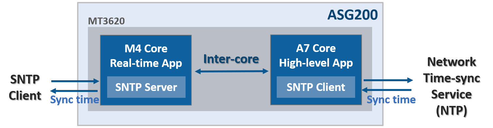

# ASG210M4 real-time application sample: SNTP Server

SNTP server sample uses inter-core communication to send/receivce time data.

* **HL(High-level) app**
  * Sync time using public network time-sync service
  * Send time data to Real-time app using inter-core communication
* **RT app**
  * Run SNTP server for private network
  * Receive the time data from High-level app and sync time to SNTP server
  
 

## Build and Run the application

Build and run each application for RT and HL core.

Refer to below.

> **Run RT app first, and next run HL app**

### Run with Visual Studio

1. Open the project
2. From the Select Startup Item menu, on the tool bar, select `GDB Debugger (RTCore)`.
3. Click `Build` > `Build All` to build the project
4. Press <kbd>**F5**</kbd> to start the application with debugging.

### Run with Visual Studio Code

1. Open the project
2. Press <kbd>**F7**</kbd> to build the project
3. Press <kbd>**F5**</kbd> to start the application with debugging

